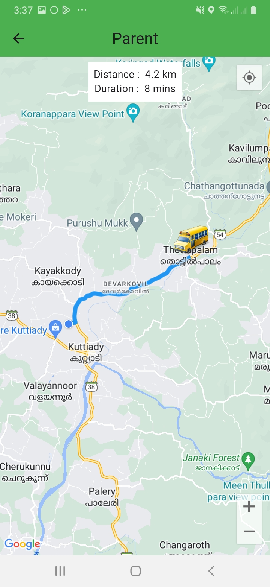

# School Vehicle Tracker

This Flutter application allows you to track school bus on a map in real-time.It utilizes Firebase for the database and sends local notifications when a bus is within 1km of your location.

## Features

- Real-time location tracking of school bus.
- Display school bus routes on the map.
- Local notifications for nearby bus.

<p align = "center">  </p>

## Google Maps Setup

1. Obtain a Google Maps API key from the Google Cloud Console.
2. Enable the Google Maps SDK for Android and iOS in the Google Cloud Console.
3. Add the API key to your Flutter app's AndroidManifest.xml and Info.plist files.
4. Follow the setup instructions for the [google_maps_flutter](https://pub.dev/packages/google_maps_flutter) package.


## Flow

1. Saving driver's location to Firebase database.
2. Showing driver's location and changes from the Firebase database to parents.
3. Parents will receive local notifications when a school bus is within 1 km of their current location.
4. Notifications will include information about the bus, such as its route and estimated time of arrival at the user's location.

## How to use

- Clone the project repository from GitHub using the command git clone.
- Create a Firebase Project.
- Create google maps API key from Google Cloud Console.
- Create a file `dbend.dart` and store a String `Firebase Project URL`.
```dart 
const dbend = Your Firebase Project URL
```
- Create another file `apikey.dart` and store a String `Google API Key`.
```dart 
const googleApiKey = Your Google API Key
```
- Ensure that the app has permission to access the device's location to provide accurate bus tracking and notification services.


## Dependencies

- [Flutter](https://flutter.dev)
- [Google Maps Flutter](https://pub.dev/packages/google_maps_flutter)
- [Firebase](https://firebase.google.com/)
- [Flutter Local Notifications](https://pub.dev/packages/flutter_local_notifications)

