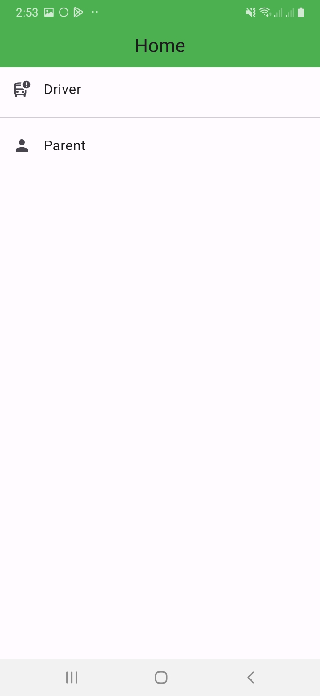
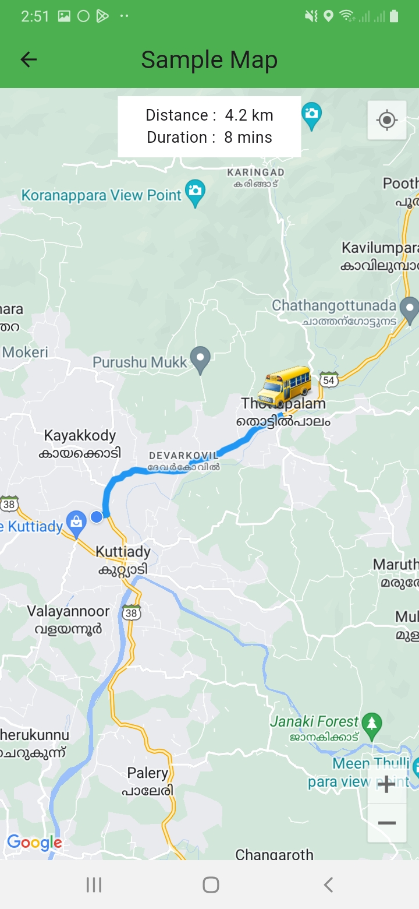

# School Vehicle Tracker

This Flutter application allows you to track school bus on a map in real-time.It utilizes Firebase for the database and sends local notifications when a bus is within 1km of your location.

## Features

- Real-time location tracking of school bus.
- Display school bus routes on the map.
- Local notifications for nearby bus.

                                   

## Google Maps Setup

1. Obtain a Google Maps API key from the Google Cloud Console.
2. Enable the Google Maps SDK for Android and iOS in the Google Cloud Console.
3. Add the API key to your Flutter app's AndroidManifest.xml and Info.plist files.
4. Follow the setup instructions for the [google_maps_flutter](https://pub.dev/packages/google_maps_flutter) package.

## Usage

- View the map to see the location of school buses.
- Click on a bus to see more details.
- Receive notifications for bus arrival and departure at your location.

## Dependencies

- [Flutter](https://flutter.dev)
- [Google Maps Flutter](https://pub.dev/packages/google_maps_flutter)
- [Firebase](https://firebase.google.com/)
- [Flutter Local Notifications](https://pub.dev/packages/flutter_local_notifications)

